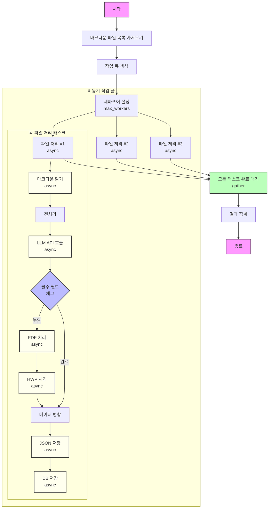

## 비동기(Asynchronous) 처리 방식 순서도

### 특징

1. 동시 실행: 여러 파일을 병렬로 처리
2. 논블로킹 I/O: I/O 작업 중 다른 작업 수행 가능
3. 세마포어로 동시 처리량 제어
4. 복잡한 에러 처리: 각 비동기 작업의 에러를 개별 처리
5. await 지점에서 작업 전환
6. 메모리 효율적: 스레드 대신 이벤트 루프 사용

### 주요 비동기 작업

- 파일 읽기/쓰기 (aiofiles)
- API 호출 (aiohttp)
- PDF/HWP 변환
- 데이터베이스 작업 (aiomysql/asyncpg)

### 성능 향상 포인트

1. I/O 작업의 대기 시간 활용
2. CPU 작업과 I/O 작업의 효율적 분배
3. 리소스 사용량 최적화
